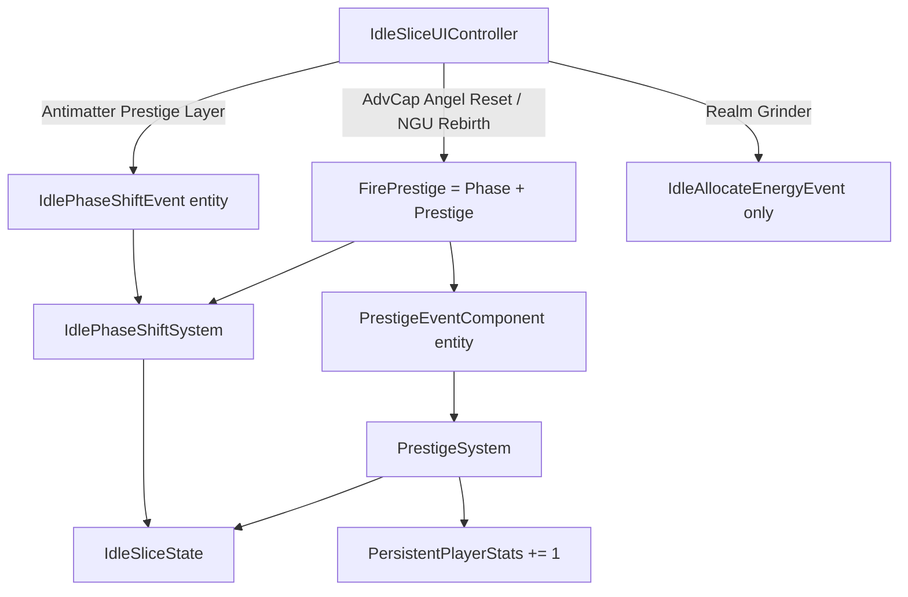

# Round 01 Review 04 — Prestige / Meta-Layer Idles

**Agent:** examine/analyze/review 4/10  
**Scope:** Antimatter Dimensions, NGU Idle, Realm Grinder, AdVenture Cap prestige hooks, `PrestigeSystem` integration  
**Repo:** `D:\Git\Hyper-Casual-Runner`  
**Mode:** Review only — no implementation, no push  
**Date:** 2026-08-10

---

## Verdict

Prestige exists as a **shared, archetype-blind reset pipe** (`PrestigeSystem` + `IdlePhaseShiftSystem`) with UI labels that sound game-specific. That is enough for Batch A/B EditMode smoke (“currency moved”), but it does **not** yet deliver the matrix prestige DNA for these four titles: nested meta-layers (AD), angel investors (AdvCap), faction-replay resets (RG), or rebirth-with-stat-retention (NGU).

**Highest-severity integration bugs** sit in the UI→event bridge and conversion math, not in missing prefabs.

---

## ASSUMPTIONS

1. Quality bar = playable MVP slice per matrix title (60FPS DOTS toolkit), not full AD/NGU clones — confidence: **high** — verified by `docs/project-context.md`, `docs/idle-toolkit-progress.md`.
2. Prestige design intent is `docs/idle_mechanics_matrix.md` pillars (esp. “Prestige as Replay Acceleration”) — confidence: **high** — file read.
3. Slice UI path (`IdleSliceUIController`) is the primary demo surface for ToolkitExamples Idle prefabs; runner HUD (`IdleUIManagerSystem`) is secondary — confidence: **high** — prefab HowTo + UI wiring.
4. System update order within `SimulationSystemGroup` is name-ordered unless attributed — confidence: **med** — no `[UpdateBefore]/After]` between Phase and Prestige; alphabetical `IdlePhaseShiftSystem` before `PrestigeSystem` is the likely live order.
5. EditMode Batch A/BC PASS does not cover prestige conversion for AdvCap/NGU/AD/RG — confidence: **high** — test file grep: only `Paperclips_PhaseShift_ConvertsToPrestige`; no `PrestigeSystem` idle tests.

---

## Architecture map (as implemented)

| Layer | Role | Key files |
|-------|------|-----------|
| Design target | Prestige models per title | `docs/idle_mechanics_matrix.md` |
| Slice state | `PrestigeCurrency`, `PhaseIndex`, `FactionId`, `EnergyPool`/`EnergyAllocated` on one blob | `IdleSliceComponents.cs` |
| Runner meta | Separate `PersistentPlayerStats.PrestigeCurrency` | `IdleComponents.cs` |
| Soft reset / layer | `IdlePhaseShiftEvent` → `IdlePhaseShiftSystem` | `IdleSliceActionSystems.cs` |
| Hard prestige | `PrestigeEventComponent` → `PrestigeSystem` | `PrestigeSystem.cs` |
| UI fire | Creates **new** event entities (does not toggle slice enableables) | `IdleSliceUIController.cs` |
| Persist | PlayerPrefs prestige + mult + gens; **not** phase/faction/energy | `GameProgressData.cs`, `IdleSliceBootstrap.cs` |



---

## Per-title findings

### 1. AdVenture Capitalist — Angel Reset

**Matrix:** Angel Investors (planet resets) + managers as earned automation.  
**UI:** Collect / Buy Business / Hire Manager / **Angel Reset** → `FirePrestige()`.  
**Sim:** Passive CPS after manager hire; Collect scales with owned businesses.

| Status | Detail |
|--------|--------|
| Partial | Manager hire → automate CPS is EditMode-covered (`AdventureCapitalist_HireManager_AutomatesPassiveRate`). |
| Broken integration | `FirePrestige()` always calls `FirePhase()` then spawns `PrestigeEventComponent` (`IdleSliceUIController.cs` ~310–316). One click runs **two** converters against the same slice. |
| Broken gate | `PrestigeSystem` forces `converted = 1` even at 0 currency (see Critical bugs). Angel Reset is free and never “earned.” |
| Dual ledger | Slice `PrestigeCurrency` gets sqrt conversion (+ forced floor); `PersistentPlayerStats` always `+= 1.0`. Cosmetics shop reads the runner ledger; slice HUD reads the idle ledger. |
| Reset surface | Clears gens/managers/`PassiveRate`; rebuilds `ClickPower`/`GlobalMultiplier` from slice prestige. Acceptable MVP angel mult, but not planet/investment curve. |

**Parity gap vs matrix:** No angel *formula* beyond shared `sqrt(currency/50)`; no threshold / “unlock angel investors” beat.

---

### 2. Antimatter Dimensions — Nested layers

**Matrix:** Nested meta-layers (Infinity → Eternity → Reality); dimensions produce lower dimensions.  
**UI:** Buy Dimension / Click Antimatter / **Prestige Layer** → `FirePhase()` only (does **not** call `PrestigeSystem`).  
**Sim:** Shares Cookie/AdvCap passive tick; single `BuyableGenerator` id=1.

| Status | Detail |
|--------|--------|
| Wired | Phase shift converts run currency → `PrestigeCurrency`, bumps `PhaseIndex`, zeros gens/`PassiveRate`, rebuilds mult. Covered indirectly by Paperclips phase test (same system). |
| Buy beat | `Antimatter_BuyDimension_RaisesOwnedAndCps` passes. |
| Under-delivered | One generator tier — no dimension cascade (Dim N → Dim N−1). `PhaseIndex` is a counter, not distinct layer economies. |
| Split pipe | AD uses Phase; Cookie/AdvCap/NGU use Prestige (+ Phase). Layer prestige never touches `PersistentPlayerStats` or runner wallet clear. Intentional soft-reset vs hard prestige is undocumented. |
| Gate softer than Prestige | Phase requires `converted >= 1 \|\| PrimaryCurrency >= 25`; Prestige’s second line forces +1 always. AD is the only scoped title with a real floor. |

**Parity gap vs matrix:** “Nested meta-layers turn prior games into resources” is stubbed as one PhaseIndex increment + shared mult formula.

---

### 3. Realm Grinder — Factions / prestige

**Matrix:** Re-pick alignment as prestige / horizontal replay; faction-specific paths.  
**UI:** Build / Align Good / Align Evil — **no Rebirth / Prestige button**.  
**Sim:** `FactionId` 1→1.5×, 2→1.25× income; Align via `IdleAllocateEnergySystem` branch.

| Status | Detail |
|--------|--------|
| Faction pick works | `RealmGrinder_AlignFaction_RaisesMultAndLevel` asserts FactionId=1 and mult↑. |
| Prestige missing | Matrix prestige model is not hooked. Align is a free permanent `GlobalMultiplier += 0.15` and `ProgressionLevel++` with **no cost and no run reset**. |
| API smell | Faction re-pick reuses `IdleAllocateEnergyEvent` (NGU’s verb). Amount 1 vs 2 encodes Good/Evil — brittle and cross-contaminates event semantics. |
| Persist gap | `FactionId` not saved in `GameProgressData.SaveIdleSlice` — reload drops alignment while mult/level may remain. |
| PrestigeSystem impact | If something later fires Prestige on this slice, it would **not** clear `FactionId` (field omitted from reset list) while wiping gens — half-reset. |

**Parity gap vs matrix:** Horizontal strategy prestige is absent; current Align is a free mult stack, not a rebuild-with-new-faction loop.

---

### 4. NGU Idle — Energy + Rebirth

**Matrix:** Allocate energy; Rebirth with stat retention; auto-allocators later.  
**UI:** Allocate Energy / Idle Tick Boost / **Rebirth** → `FirePrestige()`.  
**Sim:** `TickEnergy` regenerates pool, spends allocation into currency + SkillXp → levels/mult.

| Status | Detail |
|--------|--------|
| Core verb OK | `NguIdle_AllocateEnergy_SetsAllocation` passes; sim path exists. |
| Same FirePrestige double-hit | Rebirth = Phase + Prestige → double conversion / free Prestige floor (same as AdvCap). |
| Retention accidental | Prestige reset list does **not** clear `EnergyPool` / `EnergyAllocated` / `SkillXp` — lucky for “stat retention,” but `ProgressionLevel` **is** zeroed, and Phase may bump `PhaseIndex`/`ProgressionLevel` in the same frame depending on order. Outcome is order-dependent and untested. |
| HUD blind spot | `RefreshStats` does not show Energy pool/allocation — hard to demo the verb. |
| Persist gap | Energy fields not in PlayerPrefs save set. |

**Parity gap vs matrix:** No rebirth cost curve, no explicit “keep X / lose Y” contract, no auto-allocator.

---

## PrestigeSystem integration (cross-cutting)

### What it does well

- Single Simulation-group consumer for `PrestigeEventComponent`.
- Resets idle gens/managers + hybrid Victory SFX event (ECB).
- Rebuilds slice `ClickPower` / `GlobalMultiplier` from accumulated `PrestigeCurrency` so resets feel faster when conversion works.

### Critical bugs / risks

1. **Free prestige floor** (`PrestigeSystem.cs` ~50–52)  
   ```text
   converted = Floor(Sqrt(max(0, Primary)/50))
   if (converted < 1 && Primary >= 25) converted = 1
   if (converted < 1) converted = 1   // ← always awards ≥1
   ```
   The first threshold line is dead; any Angel/Rebirth/Cookie Prestige grants currency with empty pockets.

2. **`FirePrestige` double-fires Phase + Prestige** (`IdleSliceUIController.cs` ~310–316)  
   AdvCap Angel Reset, NGU Rebirth, Cookie Prestige, Egg Soul Prestige, Miner New Mine all hit both systems. Likely sequence: Phase converts & zeros currency → Prestige still adds +1 (bug #1) and resets again. Mult math runs twice; PhaseIndex may advance on “Angel Reset” even though AdvCap is not a phase-layer game.

3. **No `[UpdateBefore]/After]` between Phase and Prestige**  
   Conversion/retention outcomes for NGU/AdvCap are order-sensitive and untested.

4. **Enableable component misuse**  
   Bootstrap adds disabled `PrestigeEventComponent` on the slice entity, but UI/HUD `CreateEntity()` + `AddComponentData` new one-shots. Systems disable those entities rather than destroy them → entity leak under spam. Same pattern for Phase/Alloc/Click.

5. **Global queries**  
   Prestige/Phase iterate **all** `IdleSliceState` / `BuyableGenerator` / `PersistentPlayerStats`. Safe for one-slice prefabs; broken if multiple slices share a world.

6. **Dual prestige currencies**  
   `PersistentPlayerStats.PrestigeCurrency += 1` flat vs `IdleSliceState.PrestigeCurrency += converted`. Cosmetics (`CosmeticsShopSystem`) vs slice HUD disagree by design unless kept in sync (they are not).

7. **Incomplete idle reset fields**  
   Prestige clears: Primary, OwnedGens, Passive, ManagersHired, AssignedWorkers, ProgressionLevel, Enemy HP, ClickPower/Mult rebuild.  
   Does **not** clear: `FactionId`, `PhaseIndex`, `EnergyPool`, `EnergyAllocated`, `SkillXp`, `AfkChestSeconds`, `CheckInCats`, `HasOfflineClaim`.  
   Phase clears gens but also does not clear faction/energy.

8. **Zero EditMode coverage of `PrestigeSystem` idle path**  
   Paperclips covers Phase only. No test asserts Angel Reset, AD layer vs Prestige pipe, NGU rebirth retention, or free-prestige regression.

9. **Persistence incomplete for meta fields**  
   Saves PrestigeCurrency/Mult/Level/Click/Passive/Gens. Omits PhaseIndex, FactionId, Energy*, ManagersHired. AD layer depth and RG alignment do not survive session.

---

## Matrix pillar scorecard (scoped titles)

| Pillar | AdvCap | Antimatter | Realm Grinder | NGU |
|--------|--------|------------|---------------|-----|
| Prestige = faster replay | Partial (mult↑) / broken free reset | Partial (Phase mult↑) | Fail (no prestige reset) | Partial / double-fire |
| Automation earned | Pass (managers) | Weak (autobuy stub via IsAutomated) | N/A in MVP | Fail (no auto-alloc) |
| Second axis | Weak | Fail (no real layers) | Partial (Good/Evil mult only) | Partial (energy alloc) |
| Offline / absence | N/A | N/A | N/A | N/A |
| EditMode smoke | Hire only | Buy only | Align only | Alloc only |

---

## Recommended fix list for Round 01 IMPLEMENT (priority)

**P0 — correctness (do before new features)**

1. Remove dead/forced floor in `PrestigeSystem`; gate prestige on `converted >= 1` (or explicit min currency). Align Phase gate with Prestige gate.
2. Fix `FirePrestige()`: do **not** call `FirePhase()`. Route AD/Paperclips → Phase only; AdvCap/NGU/Cookie → Prestige only.
3. Add EditMode tests:  
   - `PrestigeSystem_ZeroCurrency_DoesNotAward`  
   - `AdventureCapitalist_AngelReset_ConvertsAndResetsManagers`  
   - `Antimatter_PhaseShift_IncrementsPhaseIndex`  
   - `NguIdle_Rebirth_RetainsEnergyAllocation_ResetsRunCurrency`  
   - Assert Phase and Prestige are mutually exclusive for one UI click.

**P1 — archetype contracts**

4. Realm Grinder: add Rebirth/Prestige that resets gens + currency but **keeps or re-picks** `FactionId`; stop stacking free Align mult (cost Align or make Align the prestige choice). Prefer a dedicated `IdleFactionAlignEvent` instead of hijacking energy allocate.
5. Document/code-split soft Phase (AD/Paperclips) vs hard Prestige (angels/rebirth) so dual pipes are intentional.
6. Persist `PhaseIndex`, `FactionId`, `EnergyAllocated` (and maybe `EnergyPool`) in `GameProgressData` idle keys.
7. Enable slice-owned enableable events (or DestroyEntity after handle) instead of orphan CreateEntity spam.

**P2 — MVP depth (quality-bar capped)**

8. AD: 2–3 generator tiers with crude “higher produces lower” tick **or** explicit Phase names (Infinity/Eternity) with different conversion rates — pick one stub, mark the other `// TODO: [STUB]`.
9. NGU: show Energy in HUD; define rebirth retention table (keep EnergyAllocated + GlobalMultiplier; lose Primary + SkillXp progress bar).
10. Sync or drop dual ledgers: either drive cosmetics from `IdleSliceState.PrestigeCurrency` in slice scenes, or copy slice conversion into `PersistentPlayerStats` with the same amount.

**Deferred (out of bar)**

- Full AD Reality layers, NGU feature sprawl / auto-allocators, RG spells, AdvCap multi-planet angel curve.

---

## Evidence index (read, not run this pass)

| Path | Why |
|------|-----|
| `Assets/Scripts/ECS/Systems/Idle/PrestigeSystem.cs` | Hard prestige + forced `converted = 1` |
| `Assets/Scripts/ECS/Systems/Idle/IdleSliceActionSystems.cs` | Phase shift; RG faction via energy event; NGU allocate |
| `Assets/Scripts/ECS/Systems/Idle/IdleSliceSimulationSystem.cs` | AD/AdvCap passive; RG faction bonus; NGU `TickEnergy` |
| `Assets/Scripts/UI/IdleSliceUIController.cs` | Per-archetype buttons; `FirePrestige` = Phase+Prestige |
| `Assets/Scripts/ECS/Authoring/IdleSliceBootstrap.cs` | Slice spawn, dual stats, persist fields |
| `Assets/Scripts/GameProgressData.cs` | Idle PlayerPrefs schema |
| `Assets/Scripts/Editor/Tests/IdleBatchASmokeTests.cs` | AdvCap hire, AD buy, Paperclips phase — no PrestigeSystem |
| `Assets/Scripts/Editor/Tests/IdleBatchBCSmokeTests.cs` | RG align, NGU alloc — no rebirth |
| `docs/idle_mechanics_matrix.md` | Prestige model targets |
| `docs/idle-toolkit-progress.md` | Batch A/BC PASS; Play Mode 0/19 |

---

## STATUS

**UNVERIFIED (runtime):** This review did not re-run EditMode or Play Mode. Findings are from static read of systems/UI/tests/docs.  
**To verify P0 bugs:** add the PrestigeSystem zero-currency test and/or Play Angel Reset / Rebirth at 0 currency and watch Prestige counter.

**RISKS if implementers ignore P0:** every prestige-labeled button remains a free mult pump; PhaseIndex pollutes non-layer games; RG never demonstrates prestige-as-replay.
