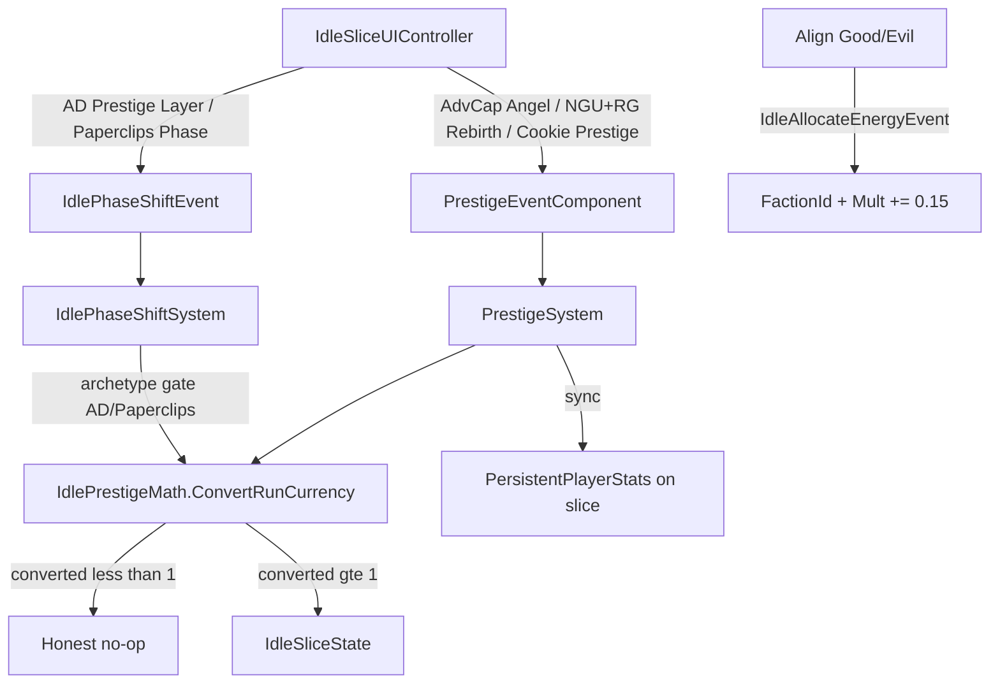

# Round 02 Review 04 — Prestige / Meta-Layer Re-Audit (post impl_02)

**Agent:** examine/analyze/review 4/10  
**Scope:** Antimatter Dimensions, NGU Idle, Realm Grinder, AdVenture Cap prestige hooks, `PrestigeSystem` / `IdlePhaseShiftSystem` / `IdlePrestigeMath` after Round 01 `impl_02_prestige.md`  
**Prior:** `.agents/idle_swarm/round_01/review_04_prestige.md`, receipt `.agents/idle_swarm/round_01/impl_02_prestige.md`  
**Repo:** `D:\Git\Hyper-Casual-Runner`  
**Mode:** Review only — no implementation, no push  
**Date:** 2026-08-10

---

## Verdict

**Round 01 P0 prestige correctness is landed.** Free prestige floor is gone, `FirePrestige` no longer double-fires Phase, TargetSlice scoping is in place, RG has a Rebirth button that keeps `FactionId`, and EditMode fixtures cover the P0 matrix. Soft Phase (AD/Paperclips) vs hard Prestige (AdvCap/NGU/Cookie/RG/Egg/Miner) is an intentional dual pipe.

**Remaining gap is MVP depth / P1 contracts**, not the R1 free-reset crisis: Realm Grinder Align is still a free mult/level stack on a hijacked energy event; AD layers are still a `PhaseIndex` counter; NGU rebirth retention is coded but HUD-blind; runner HUD prestige path is still a legacy sole-slice / free-+1 fallback. Quality bar for toolkit demos is now reachable if implementers close Align + HUD/persist polish — not if they chase full AD Reality stacks.

---

## ASSUMPTIONS

1. Quality bar = playable MVP slice per matrix title, not full AD/NGU clones — confidence: **high** — `docs/project-context.md`.
2. `impl_02` P0 claims are the baseline to re-check; peers (`57910f7`, `1e2d9df`) may own overlapping diffs — confidence: **high** — receipt + `git`-visible HEAD code.
3. Soft Phase vs hard Prestige split is intentional after R1 — confidence: **high** — `FirePrestige` comment, `IdlePhaseShiftSystem` archetype gate, AngelReset `PhaseIndex==0` tests.
4. Latest AllSmoke truth is `Logs/IdleAllSmoke-Summary.txt` (`pass=46 fail=0`), not the mid-swarm `IdleAllSmoke-prestige-impl02.log` alone — confidence: **high** — file read; that older log’s 2 fails were **combat**, not prestige-named tests.
5. Slice UI (`IdleSliceUIController`) remains the primary demo surface; `IdleUIManagerSystem` is secondary runner HUD — confidence: **high** — prefab HowTo + wiring.

---

## Round 01 P0 → Round 02 status

| R1 P0 item | Status now | Evidence |
|------------|------------|----------|
| 1. Remove forced `converted = 1`; gate on `converted >= 1` | **FIXED** | `IdlePrestigeMath.ConvertRunCurrency` returns 0 below threshold; soft grant only when `PrimaryCurrency >= 25`. `PrestigeSystem` / Phase both no-op when `converted < 1`. Dead `if (converted < 1) converted = 1` **absent**. |
| 2. `FirePrestige()` must not call `FirePhase()` | **FIXED** | `IdleSliceUIController.FirePrestige` creates `PrestigeEventComponent` only (+ `TargetSlice`). |
| 3a. Zero-currency prestige | **COVERED** | `PrestigeSystem_ZeroCurrency_DoesNotAward` — Passed in prestige-impl02 log. |
| 3b. AdvCap Angel Reset | **COVERED** | `AdventureCapitalist_AngelReset_ConvertsAndResetsManagers` + manager re-lock `A3_*`. |
| 3c. AD PhaseIndex | **COVERED** | `Antimatter_PhaseShift_IncrementsPhaseIndex`. |
| 3d. NGU rebirth retention | **COVERED** | `NguIdle_Rebirth_RetainsEnergyAllocation_ResetsRunCurrency` (keeps Energy*/SkillXp; zeros Primary + ProgressionLevel). |
| 3e. Phase vs Prestige exclusive per UI click | **COVERED** | `FirePrestige_DoesNotAlsoCreatePhaseEvent_*` + AngelReset `PhaseIndex==0`. |
| RG Rebirth keep FactionId | **FIXED** | UI `Rebirth` → `FirePrestige`; retention comment in `PrestigeSystem`; `RealmGrinder_Rebirth_ResetsRun_KeepsFaction`. |

**Receipt caveat:** `impl_02` cited `IdleAllSmoke-prestige-impl02.log` as VERIFIED while that run ended `pass=44 fail=2`. Prestige-named lines in that log are **Passed**; failures were `ClickerHeroes_*` / `IdleHeroes_*` (combat). Current `Logs/IdleAllSmoke-Summary.txt` is `pass=46 fail=0`. Do not treat the old fail=2 as a prestige regression.

---

## Architecture map (as implemented now)

| Layer | Role | Key files |
|-------|------|-----------|
| Shared math | `ConvertRunCurrency`, manager-gate reset | `IdlePrestigeMath.cs` |
| Hard prestige | TargetSlice-scoped reset + ledger sync | `PrestigeSystem.cs` |
| Soft phase | AD / Paperclips only; same convert math | `IdlePhaseShiftSystem` in `IdleSliceActionSystems.cs` |
| Event routing | Prefer `TargetSlice`; sole-slice fallback; refuse multi-slice blast | `IdleEventTarget.cs` |
| Slice UI | Phase vs Prestige buttons by archetype | `IdleSliceUIController.cs` |
| Persist | Prestige + Phase + Faction + EnergyAllocated + managers | `GameProgressData.SaveIdleSlice`, `IdleSliceBootstrap` |
| Cosmetics | Prefer slice prestige ledger; sync PersistentPlayerStats | `CosmeticsShopSystem.cs` |

---

## Per-title findings (re-audit)

### 1. AdVenture Capitalist — Angel Reset

| Status | Detail |
|--------|--------|
| **P0 fixed** | Angel Reset → hard prestige only; no PhaseIndex advance; conversion gated; managers re-locked via `IdlePrestigeMath.ResetBuyableGenerator`. |
| **MVP OK** | Shared `sqrt(currency/50)` (+ soft 25→1) angel curve is acceptable toolkit MVP. |
| Residual | No planet/investment curve; still one business generator. Out of bar unless matrix demands more. |

### 2. Antimatter Dimensions — Nested layers

| Status | Detail |
|--------|--------|
| **P0 fixed** | Prestige Layer → Phase only; increments `PhaseIndex`; gated convert; Phase archetype-locked so Cookie/AdvCap cannot Phase-pollute via this system. |
| Under-delivered | Still one Dim generator; `PhaseIndex` is a counter, not Infinity/Eternity economies. |
| Residual | Documented as P2/`TODO: [STUB]` territory — same as R1 P2 item 8. |

### 3. Realm Grinder — Factions / prestige

| Status | Detail |
|--------|--------|
| **P0 fixed** | `Rebirth` button present; hard prestige resets run, **keeps `FactionId`**; PhaseIndex stays 0. |
| **Still broken (P1)** | Align Good/Evil remains free: `GlobalMultiplier += 0.15`, `ProgressionLevel++`, no cost, no run reset. Still hijacks `IdleAllocateEnergyEvent` (amount 1 vs 2). |
| Interaction note | Hard rebirth **rebuilds** `GlobalMultiplier` from `PrestigeCurrency`, wiping Align’s free stacks while keeping FactionId income bonus in sim. Align is a free temporary pump + level spam until Rebirth. |
| Persist | `FactionId` now saved/loaded — R1 persist gap for faction **closed**. |

### 4. NGU Idle — Energy + Rebirth

| Status | Detail |
|--------|--------|
| **P0 fixed** | Rebirth = Prestige only; retains `EnergyPool` / `EnergyAllocated` / `SkillXp`; resets Primary + ProgressionLevel; no PhaseIndex. |
| Residual | Retention is accidental-list → now intentional comment, but no explicit “keep X / lose Y” product table beyond code. |
| **HUD blind** | `RefreshStats` still omits Energy pool/allocation — demo verb hard to see. |
| Persist | `EnergyAllocated` saved; **`EnergyPool` not persisted** (reload may drop pool while allocation restores). |

---

## Cross-cutting integration (post-fix)

### What improved vs R1

- Shared `IdlePrestigeMath` (gate + manager reset) used by Prestige + Phase + production path.
- TargetSlice / sole-slice / refuse-multi-slice (`IdleEventTarget`) — R1 world-wide blast mitigated for idle events.
- Dual ledger softened: prestige write syncs `PersistentPlayerStats` on the slice; cosmetics prefer `IdleSliceState.PrestigeCurrency`.
- Phase vs Prestige split documented in code + tests.
- Meta persist for Phase/Faction/EnergyAllocated/managers landed in `GameProgressData`.
- Prestige ephemeral UI events are destroyed when the event entity is not the slice (Phase always destroys).

### Open bugs / risks (priority)

1. **RG Align free-stack (P1 — still highest remaining prestige DNA gap)**  
   `IdleAllocateEnergySystem` RealmGrinder branch: free FactionId + Mult + Level. Matrix wants alignment as prestige/replay choice, not a free button.

2. **Runner HUD `IdleUIManagerSystem.OnPrestigeButtonClicked`**  
   Still `CreateEntity` + `PrestigeEventComponent()` with **no TargetSlice**. Relies on sole-slice fallback; runner-only world path still does `PersistentPlayerStats += 1` with no currency gate. Secondary surface, but free-meta if used without idle slice.

3. **Cosmetics first-slice grab**  
   `CosmeticsShopSystem` spends on the first `IdleSliceState`+stats query hit, not a purchase `TargetSlice`. Fine for one-slice prefabs; wrong in multi-slice worlds.

4. **Prestige vs Phase ECB asymmetry**  
   Phase destroys event entities; Prestige disables + destroys non-slice events. Bootstrap keeps disabled `PrestigeEventComponent` on the slice (enableable pattern). Spam from HUD without TargetSlice still depends on sole-slice resolution.

5. **NGU HUD / EnergyPool persist**  
   Demo + session continuity still weak for the energy verb.

6. **AD layer depth**  
   Still P2 stub; not a correctness bug.

7. **No `[UpdateBefore]/After]` between Phase and Prestige**  
   Lower severity after pipe split (UI no longer fires both). Still order-sensitive if both events are injected in one frame in tests/tools.

8. **Play Mode unverified**  
   EditMode covers P0; angel/rebirth *feel* and UI Toolkit wiring not Play-Mode proven in this audit.

---

## Matrix pillar scorecard (scoped titles)

| Pillar | AdvCap | Antimatter | Realm Grinder | NGU |
|--------|--------|------------|---------------|-----|
| Prestige = faster replay | **Pass** (gated angel + mult↑) | **Partial** (Phase mult↑; no real layers) | **Partial** (Rebirth OK; Align free-stack undermines) | **Pass** (gated rebirth + mult↑; retention OK) |
| Automation earned | Pass (managers + re-lock) | Weak | N/A MVP | Fail (no auto-alloc) |
| Second axis | Weak | Fail (counter only) | Partial (Good/Evil + keep on rebirth) | Partial (energy alloc) |
| EditMode prestige | Angel + zero-currency + re-lock | PhaseIndex | Rebirth keep Faction | Rebirth retain Energy |

---

## Recommended fix list for Round 02 IMPLEMENT (priority)

**P0 — none remaining from R1 prestige correctness** (re-open only if a regression appears).

**P1 — archetype contracts / demo honesty**

1. Realm Grinder Align: stop free Mult/Level stack. Prefer dedicated `IdleFactionAlignEvent` (or cost Align / make Align the prestige choice that resets gens). Acceptance: Align alone does not raise Mult without spend/reset; Rebirth still keeps or re-picks FactionId; EditMode asserts.
2. Wire `IdleUIManagerSystem` prestige to `TargetSlice` (or remove button from idle-slice scenes) and apply the same `ConvertRunCurrency` gate on runner-only path (no flat `+= 1`).
3. NGU: show EnergyPool / EnergyAllocated in `RefreshStats`; persist `EnergyPool` (or document that allocation-only persist is intentional).
4. Cosmetics: scope spend to event TargetSlice / owning slice when multi-slice possible.

**P2 — MVP depth (quality-bar capped)**

5. AD: 2–3 Dim tiers **or** named Phase bands with different rates — one stub, mark the other `// TODO: [STUB]`.
6. Optional `[UpdateBefore]/After(typeof(IdlePhaseShiftSystem))]` on `PrestigeSystem` (or reverse) to pin same-frame dual-event order for tools/tests.
7. Destroy-or-disable consistency for all idle one-shot events (cosmetics/prestige/phase).

**Deferred (out of bar)**

- Full AD Reality layers, NGU auto-allocators, RG spells, AdvCap multi-planet angel curve.

---

## Evidence index

| Path | Why |
|------|-----|
| `Assets/Scripts/ECS/Systems/Idle/IdlePrestigeMath.cs` | Shared convert gate + manager reset |
| `Assets/Scripts/ECS/Systems/Idle/PrestigeSystem.cs` | Hard prestige; retention comment; TargetSlice |
| `Assets/Scripts/ECS/Systems/Idle/IdleSliceActionSystems.cs` | Phase gate; RG Align free-stack |
| `Assets/Scripts/ECS/Systems/Idle/IdleEventTarget.cs` | Slice resolution contract |
| `Assets/Scripts/UI/IdleSliceUIController.cs` | FirePrestige vs FirePhase; RG Rebirth; HUD stats |
| `Assets/Scripts/UI/IdleUIManagerSystem.cs` | Legacy prestige without TargetSlice |
| `Assets/Scripts/ECS/Systems/Idle/CosmeticsShopSystem.cs` | Slice-ledger prefer + sync |
| `Assets/Scripts/GameProgressData.cs` | Phase/Faction/EnergyAllocated keys |
| `Assets/Scripts/Editor/Tests/IdleBatchASmokeTests.cs` | ZeroCurrency, AngelReset, PhaseIndex, exclusivity |
| `Assets/Scripts/Editor/Tests/IdleBatchBCSmokeTests.cs` | RG Rebirth, NGU Rebirth |
| `Logs/IdleAllSmoke-prestige-impl02.log` | Prestige-named Passed; overall fail=2 combat |
| `Logs/IdleAllSmoke-Summary.txt` | Latest `pass=46 fail=0` |
| `.agents/idle_swarm/round_01/impl_02_prestige.md` | R1 receipt to re-audit |
| `docs/idle_mechanics_matrix.md` | Prestige model targets |

---

## STATUS

**VERIFIED (static + prior EditMode logs):** R1 P0 prestige items are present in HEAD code and were green in the prestige-named AllSmoke lines; current summary file is 46/46.  
**UNVERIFIED (this pass):** Did not re-run Unity EditMode/Play Mode. Risks if Summary is stale relative to uncommitted cosmetics/other edits.  
**To verify for R2 implementers:** re-run AllIdleSmoke after Align/HUD fixes; Play Angel Reset / RG Rebirth / NGU Rebirth once in a ToolkitExamples slice.

**RISKS if R2 ignores P1:** RG still demos “free Align” as progression; runner HUD can reintroduce ungated meta prestige; NGU energy verb stays invisible in the HUD.
