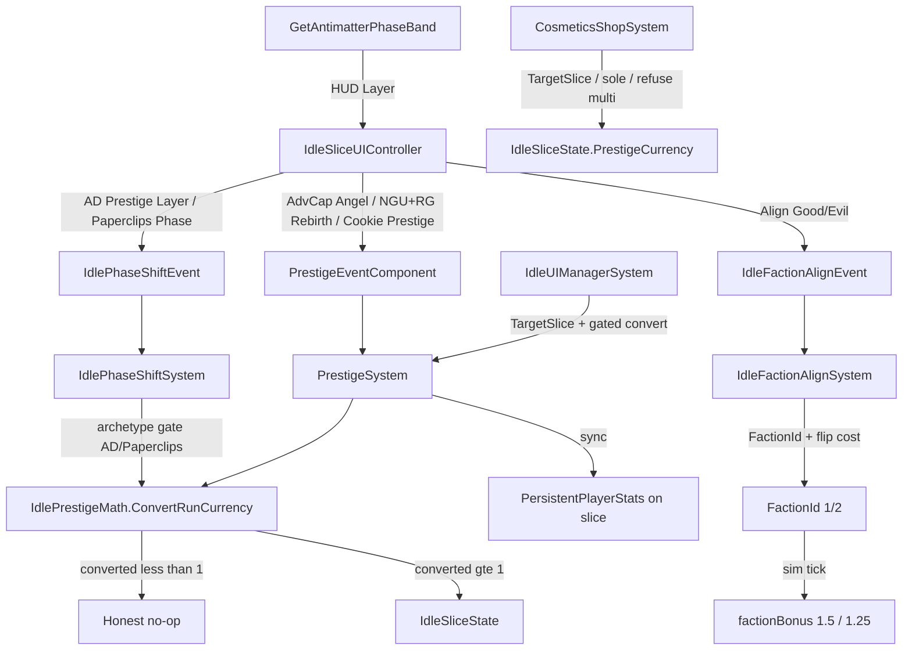

# Round 04 Review 04 — Prestige / Meta-Layer Re-Audit (post impl_05 R3)

**Agent:** examine/analyze/review 4/10  
**Scope:** Antimatter Dimensions, NGU Idle, Realm Grinder, AdVenture Cap prestige hooks; `PrestigeSystem` / `IdlePhaseShiftSystem` / `IdleFactionAlignSystem` / `IdlePrestigeMath` / cosmetics TargetSlice / EnergyPool after Round 03 `impl_05_prestige.md`  
**Prior:** `.agents/idle_swarm/round_03/review_04_prestige.md`, receipt `.agents/idle_swarm/round_03/impl_05_prestige.md`  
**Repo:** `D:\Git\Hyper-Casual-Runner`  
**Mode:** Review only — no implementation, no push  
**Date:** 2026-08-10  
**HEAD (audit):** `5717905` (prestige polish landed in ancestor `763a323`)

---

## Verdict

**Prestige correctness and R3 P2 polish are landed and still green.** Align flip costs PrimaryCurrency on re-pick; AD exposes named Phase bands + Dim STUB; compose no longer cites the deleted free-Mult Align fixture; AllSmoke summary is `pass=72 fail=0`. Soft Phase vs hard Prestige dual pipe remains intentional.

**No P0/P1 prestige reopen.** Remaining work is thin coverage/polish residual: EditMode never asserts `GetAntimatterPhaseBand` (receipt overclaimed that), Align→`factionBonus` income still untested, Phase↔Prestige order still unpinned, Cosmetics TargetSlice still outside AllIdleSmoke, Play Mode still unverified. Quality bar for toolkit demos is **met** — do not gold-plate AD Reality / paid Align redesigns.

---

## ASSUMPTIONS

1. Quality bar = playable MVP slice per matrix title, not full AD/NGU clones — confidence: **high** — `docs/project-context.md`.
2. R3 `impl_05` claims are the baseline to re-check against HEAD code + smoke logs — confidence: **high** — receipt `763a323` + file reads + `Logs/IdleAllSmoke-Summary.txt` `72/0`.
3. Soft Phase vs hard Prestige split stays intentional — confidence: **high** — `FirePrestige` / Phase archetype gate / AngelReset `PhaseIndex==0` fixtures.
4. Prestige-related working tree is clean at audit (no uncommitted diffs on prestige paths) — confidence: **high** — `git status --short` empty on those paths.
5. Slice UI remains primary demo surface; runner `IdleUIManagerSystem` is secondary — confidence: **high** — ToolkitExamples + HowTo wiring.
6. AllIdleSmoke = `IdleBatchASmokeTests` + `IdleBatchBCSmokeTests` only (not CosmeticsShopTests) — confidence: **high** — `IdleBatchATestRunner.RunAllIdleSmokeAndExit`.

---

## Round 03 P2 → Round 04 status

| R3 P2 / soft item (review_04 + impl_05) | Status now | Evidence |
|-----------------------------------------|------------|----------|
| Align flip cost (first free; re-pick spends) | **FIXED** | `IdleFactionAlignSystem` + `RealmGrinderAlignFlipCost`; fixtures `RealmGrinder_AlignFlip_*` Passed in prestige-impl05-r3 / later AllSmoke |
| AD named Phase bands + Dim STUB | **MOSTLY FIXED** | `GetAntimatterPhaseBand` + HUD Layer line + bootstrap `TODO: [STUB]`; **EditMode does not assert band strings** (receipt overclaim) |
| Compose doc drift (`RaisesMultAndLevel`) | **FIXED** | `docs/idle-toolkit-compose.md` cites `SetsFactionWithoutFreeMult` + flip fixtures; grep empty for stale name |
| Phase↔Prestige `[UpdateBefore]` | **SKIPPED** | Still absent — deferred |
| Destroy-or-disable sweep | **SKIPPED** | Prestige/Cosmetics still disable-heavy; Phase/Align destroy |
| Cosmetics into AllSmoke | **SKIPPED** | Still `CosmeticsShopTests` only |
| Play Mode walkthrough | **SKIPPED** | Still unverified this pass |

**R1 P0 / R2 P1 matrix (spot-check):** still present — zero-currency no-op, Angel Reset, AD PhaseIndex, NGU rebirth retention, FirePrestige exclusivity, runner ConvertRunCurrency gate, RG Rebirth keeps Faction, Align no free Mult, EnergyPool persist — all Passed in recent AllSmoke prestige-named lines.

**Receipt caveat:** `impl_05` claimed `Antimatter_PhaseShift_IncrementsPhaseIndex` “asserts bands.” Current fixture only asserts `PhaseIndex == 1`, `PrestigeCurrency > 0`, currency zeroed — **no** `GetAntimatterPhaseBand` call. Band honesty is code+HUD only until an EditMode line is added.

---

## Architecture map (as implemented now)

| Layer | Role | Key files |
|-------|------|-----------|
| Shared math | `ConvertRunCurrency`, Align flip cost, AD band names, manager-gate reset | `IdlePrestigeMath.cs` |
| Hard prestige | TargetSlice-scoped reset + ledger sync; runner-only gated path | `PrestigeSystem.cs` |
| Soft phase | AD / Paperclips only; same convert math; Dim STUB comment | `IdlePhaseShiftSystem` in `IdleSliceActionSystems.cs` |
| RG Align | FactionId only; first free; re-pick costs 25 Primary; income via sim `factionBonus` | `IdleFactionAlignSystem` |
| Event routing | Prefer TargetSlice; sole-slice fallback; refuse multi-slice blast | `IdleEventTarget.cs` |
| Slice UI | Phase vs Prestige vs Align by archetype; Energy + Layer + Faction HUD | `IdleSliceUIController.cs` |
| Runner HUD | Prestige + cosmetics with `ResolveSoleIdleSlice` | `IdleUIManagerSystem.cs` |
| Persist | Prestige + Phase + Faction + EnergyAllocated + **EnergyPool** + managers | `GameProgressData.SaveIdleSlice`, `IdleSliceBootstrap` |
| Cosmetics | TargetSlice / sole-slice idle ledger; runner-only PersistentPlayerStats | `CosmeticsShopSystem.cs` |

---

## Per-title findings (re-audit)

### 1. AdVenture Capitalist — Angel Reset

| Status | Detail |
|--------|--------|
| **P0/P1 OK** | Angel Reset → hard prestige only; gated convert; managers re-locked; no PhaseIndex. |
| **MVP OK** | Shared `sqrt(currency/50)` (+ soft 25→1) angel curve acceptable. |
| Residual | No planet/investment curve — P2/out of bar. |

### 2. Antimatter Dimensions — Nested layers

| Status | Detail |
|--------|--------|
| **P0 OK** | Prestige Layer → Phase only; increments `PhaseIndex`; gated convert; archetype-locked. |
| **R3 polish** | Named bands (`Dimension`/`Infinity`/`Eternity`/`Reality`) + HUD Layer line; multi-Dim `TODO: [STUB]`. |
| Gap | EditMode does **not** lock band strings to PhaseIndex — receipt/compose imply more coverage than exists. |
| Residual | Still one Dim generator — intentional STUB, not a regression. |

### 3. Realm Grinder — Factions / prestige

| Status | Detail |
|--------|--------|
| **P0 OK** | Rebirth keeps `FactionId`; run reset; PhaseIndex stays 0. |
| **P1 OK** | Align no Mult/Level spam; dedicated event. |
| **R3 polish** | First Align free; re-pick spends `RealmGrinderAlignFlipCost` (25); underfunded / same-faction no-op; run gold sync on spend. |
| Residual (P2) | Align still does not reset gens (not folded into Rebirth choice). No EditMode assert that Align raises income via `factionBonus`. Cost constant is demo-tuned. |

### 4. NGU Idle — Energy + Rebirth

| Status | Detail |
|--------|--------|
| **P0 OK** | Rebirth retains Energy*/SkillXp; resets Primary + ProgressionLevel. |
| **P1 OK** | Energy HUD line; EnergyPool PlayerPrefs round-trip fixture green. |
| Residual | No auto-allocator (deferred); retention table still comment-in-code only. |

---

## Cross-cutting integration (post-fix)

### What improved vs R3 review baseline

- Align flip cost policy **present** in HEAD (`IdleFactionAlignSystem` + fixtures).
- AD named bands helper + HUD + Dim STUB comments **present**.
- Compose Align/AD cells honest (no `RaisesMultAndLevel`).
- AllSmoke recovered to **72/0** (R3 impl AllSmoke had peer cozy/combat fails; current summary green).
- Prior P0/P1 contracts unchanged and still passing in prestige-named lines.

### Open bugs / risks (priority)

1. **AD band EditMode gap / receipt honesty (P2 — coverage)**  
   `GetAntimatterPhaseBand` untested. Cheap fix: assert `"Infinity"` after first PhaseShift (PhaseIndex 1). Compose parenthetical currently oversells fixture coverage.

2. **No EditMode assert that Align raises income via factionBonus (P2)**  
   Cost/no-Mult fixtures exist; income DNA for Good/Evil still sim-only. Cheap: tick before/after Align with owned gens.

3. **Phase ↔ Prestige system order unpinned (P2)**  
   No `[UpdateBefore]/After]`. Lower severity after pipe split; still order-sensitive if both events injected same frame.

4. **One-shot event destroy asymmetry (P2)**  
   Phase/Align destroy ephemeral entities; Prestige/Cosmetics often disable-only (bootstrap enableable pattern). Cosmetic spam entities may linger disabled.

5. **Cosmetics TargetSlice not in AllIdleSmoke (P2 — coverage)**  
   Dedicated `CosmeticsShopTests` only — AllSmoke alone is insufficient cosmetics proof.

6. **Play Mode unverified (same as R1–R3)**  
   EditMode covers contracts; Angel/Rebirth/Align/Layer *feel* and ToolkitExamples wiring not Play-proven this pass.

7. **Align cost is demo-tuned (P2 — product)**  
   `25` Primary is not matrix-sourced; acceptable MVP. Do not redesign into full faction prestige without bar change.

---

## Matrix pillar scorecard (scoped titles)

| Pillar | AdvCap | Antimatter | Realm Grinder | NGU |
|--------|--------|------------|---------------|-----|
| Prestige = faster replay | **Pass** | **Partial** (Phase mult↑ + named bands; no real layer economies) | **Pass** (gated Rebirth; Align flip costs; no Mult spam) | **Pass** |
| Automation earned | Pass (managers + re-lock) | Weak | N/A MVP | Fail (no auto-alloc) |
| Second axis | Weak | Partial-MVP (named bands + Dim STUB) | **Pass-MVP** (Good/Evil income + keep on rebirth + flip cost) | Pass-MVP (energy alloc + HUD + persist) |
| EditMode prestige | Angel + zero + re-lock + runner gate | PhaseIndex (bands **unasserted**) | Align no free Mult + flip cost + Rebirth keep Faction | Rebirth retain + EnergyPool persist |

---

## Recommended fix list for Round 04 IMPLEMENT (priority)

**P0 — none.** Re-open only on regression of convert gate, FirePrestige exclusivity, Align Mult free-stack, runner flat +1, or Align flip cost.

**P1 — none remaining from R2/R3 prestige DNA.** Optional soft honesty if swarm wants cheap EditMode truth:

1. Assert `IdlePrestigeMath.GetAntimatterPhaseBand(1) == "Infinity"` (and/or after PhaseShift on AD slice). Acceptance: fixture fails if band map regresses; compose may cite the assert explicitly.

**P2 — polish / coverage (quality-bar capped)**

2. Optional Align income assert: Good Align Passive tick &gt; Neutral over fixed dt (locks `factionBonus` path).
3. Optional `[UpdateBefore]/After(typeof(IdlePhaseShiftSystem))]` on `PrestigeSystem` (or reverse).
4. Destroy-or-disable consistency for cosmetics/prestige ephemeral entities.
5. Fold `CosmeticsShopSystem_TargetSlice_*` into AllIdleSmoke **or** document CosmeticsShopTests as required CI sibling.
6. Play Mode once: Angel Reset / RG Align→flip→Rebirth / NGU Rebirth / AD Layer HUD on ToolkitExamples slices.

**Deferred (out of bar)**

- Full AD Reality economies / Dim2–Dim3 buyables, NGU auto-allocators, RG spells, AdvCap multi-planet angel curve, folding Align into Rebirth as the only faction pick.

---

## Evidence index

| Path | Why |
|------|-----|
| `Assets/Scripts/ECS/Systems/Idle/IdlePrestigeMath.cs` | Convert gate; AlignFlipCost; GetAntimatterPhaseBand |
| `Assets/Scripts/ECS/Systems/Idle/PrestigeSystem.cs` | Hard prestige; runner gate; retention; combat Lv sync |
| `Assets/Scripts/ECS/Systems/Idle/IdleSliceActionSystems.cs` | Phase gate; Align cost/no-op; energy alloc (no Align hijack) |
| `Assets/Scripts/ECS/Systems/Idle/IdleSliceSimulationSystem.cs` | RG `factionBonus` income |
| `Assets/Scripts/ECS/Systems/Idle/IdleEventTarget.cs` | Slice resolution contract |
| `Assets/Scripts/UI/IdleSliceUIController.cs` | FirePrestige/Phase/Align; Energy + Layer + Faction HUD |
| `Assets/Scripts/UI/IdleUIManagerSystem.cs` | Runner prestige TargetSlice |
| `Assets/Scripts/ECS/Systems/Idle/CosmeticsShopSystem.cs` | TargetSlice-scoped spend |
| `Assets/Scripts/GameProgressData.cs` | EnergyPool + Faction/Phase keys |
| `Assets/Scripts/ECS/Authoring/IdleSliceBootstrap.cs` | Dim tiers `TODO: [STUB]`; EnergyPool load |
| `Assets/Scripts/Editor/Tests/IdleBatchASmokeTests.cs` | ZeroCurrency, AngelReset, PhaseIndex, runner gate, exclusivity |
| `Assets/Scripts/Editor/Tests/IdleBatchBCSmokeTests.cs` | Align no free Mult, AlignFlip cost/no-op, RG Rebirth, NGU EnergyPool/Rebirth |
| `Assets/Scripts/Editor/Tests/CosmeticsShopTests.cs` | TargetSlice spend isolation (outside AllSmoke) |
| `Assets/Scripts/Editor/IdleBatchATestRunner.cs` | AllIdleSmoke filter = A + BC only |
| `Logs/IdleAllSmoke-prestige-impl05-r3.log` | R3 prestige-named Passed (suite then had peer fails) |
| `Logs/IdleAllSmoke-Summary.txt` | Current `pass=72 fail=0` |
| `.agents/idle_swarm/round_03/impl_05_prestige.md` | R3 receipt under audit |
| `.agents/idle_swarm/round_03/review_04_prestige.md` | R3 baseline |
| `docs/idle_mechanics_matrix.md` | Prestige model targets |
| `docs/idle-toolkit-compose.md` | Align cost + AD band/STUB cells |

---

## STATUS

**VERIFIED (static + prior EditMode logs):** R2 P1 + R3 Align flip / AD band helper / compose honesty present in HEAD; prestige-named AllSmoke lines Passed in R3+ later logs; current Summary `72/0`.  
**UNVERIFIED (this pass):** Did not re-run Unity EditMode/Play Mode. Cosmetics TargetSlice relies on dedicated test file + code read, not AllSmoke. Band-name mapping is code/HUD-verified only (no EditMode assert).  
**To verify for R4 implementers:** only needed if touching prestige; otherwise treat P0/P1 as closed and optional P2 list above.

**RISKS if R4 gold-plates:** AD Reality stacks / Align-into-Rebirth redesign waste past quality bar. Real residual risk is **coverage honesty** (band helper and cosmetics TargetSlice look “done” in receipts/docs while AllSmoke/EditMode never lock them).
